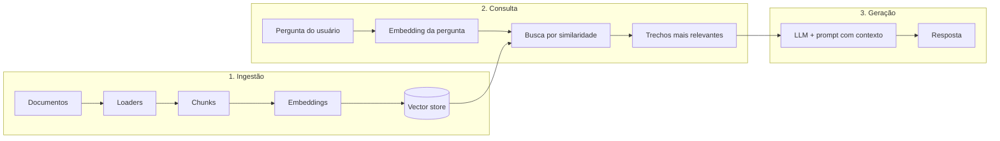

# RAG — Geração Aumentada por Recuperação

> **Em uma frase:** o modelo de linguagem **não inventa sozinho** sobre os seus documentos — ele **recupera trechos relevantes** e **gera** a resposta em cima desse contexto.

---

## O que é RAG?

**RAG** (*Retrieval-Augmented Generation*) é uma técnica comum em stacks como o **LangChain**. Ela melhora a **precisão** e a **confiabilidade** de LLMs (GPT, Gemini, Llama, etc.) ao **ligar o modelo a bases de conhecimento externas**.

| Só o LLM (sem RAG) | Com RAG |
|--------------------|---------|
| Conhecimento limitado ao treino + eventual data de corte | Respostas apoiadas em **os seus** PDFs, sites ou bases |
| Risco maior de “chute” fora do domínio | Contexto **recuperado** antes de gerar texto |

**Em vez de depender só do treinamento**, o RAG:

1. **Busca** trechos relevantes nos **seus** documentos (PDF, web, banco de dados…).
2. **Entrega** esse material ao LLM junto com a pergunta.
3. O modelo **gera** uma resposta **contextualizada** e mais alinhada ao conteúdo que você controla.

---

## Fluxo visual (visão geral)

---

## Como o RAG funciona no LangChain (passo a passo)

<strong>1 — Ingestão de dados</strong> (carregar e fatiar)

- **Loaders** leem fontes: PDF, páginas web, Notion, etc.
- O texto é dividido em **chunks** (pedaços) com tamanho e sobreposição configuráveis — isso equilibra **contexto** vs. **precisão da busca**.

<strong>2 — Embeddings e vector store</strong>

- Cada chunk vira um **vetor numérico** (embedding) que representa o “sentido” do texto.
- Os vetores ficam num **banco vetorial** (ex.: **FAISS**, Pinecone, Chroma, Qdrant) para busca rápida por **similaridade**.

<strong>3 — Busca contextual</strong>

- A **pergunta** também vira um vetor.
- O sistema recupera os **chunks mais parecidos** com a pergunta (os “vizinhos” no espaço vetorial).

<strong>4 — Geração</strong>

- O LangChain monta um prompt com: **pergunta** + **trechos recuperados**.
- O **LLM** responde usando esse contexto — o que **reduz alucinações** e ajuda a **citar ou ancorar** a resposta no material fornecido.

---

## Por que usar RAG com LangChain?

| Motivo | Ideia prática |
|--------|----------------|
| **Dados proprietários** | Contratos, RH, docs internos — sem retreinar o modelo. |
| **Informação atualizada** | Atualiza os documentos ou a base; o RAG reflete mudanças sem novo treino do LLM. |
| **Menos alucinação** | A resposta é “puxada” para o que foi **recuperado**, não só para memória paramétrica. |
| **Modularidade** | Trocar LLM (ex.: API ↔ modelo local), trocar vector store ou loaders com menos acoplamento. |

---

## Componentes principais no LangChain

| Componente | Papel |
|------------|--------|
| **Document loaders** | Entrada de dados (PDF, web, etc.). |
| **Vector stores** | FAISS, Pinecone, Chroma, Qdrant… |
| **Retrievers** | Camada que **busca** chunks no store (com regras como `k` vizinhos, filtros…). |
| **Chains** | Orquestram **recuperação + geração** (ex.: fluxos estilo pergunta-resposta com contexto). |

---

## Autoavaliação rápida (didática)

Responda mentalmente:

1. **O que muda** entre “só perguntar ao LLM” e “RAG”? *(Dica: onde entra o vector store?)*
2. Por que fatiar documentos em **chunks** em vez de indexar o arquivo inteiro de uma vez?
3. **Embeddings** são mais parecidos com: *(a)* texto legível *(b)* listas de números que representam significado?

Clique para ver sugestões de resposta

1. No RAG, há uma etapa de **recuperação** antes da geração: trechos relevantes vêm do **vector store**, não só da “cabeça” do modelo.
2. Chunks equilibram **granularidade da busca** e **tamanho do contexto** — pedaços muito grandes diluem a busca; muito pequenos perdem contexto.
3. **(b)** — vetores numéricos; o modelo de embedding traduz texto em representação matemática para comparar similaridade.

---

## Referência rápida — glossário

| Termo | Significado curto |
|-------|-------------------|
| **Chunk** | Pedaço de texto indexado. |
| **Embedding** | Vetor que representa significado para busca semântica. |
| **Retriever** | Objeto que devolve os melhores trechos para uma query. |
| **Chain** | Pipeline que liga passos (prompt + LLM + parser, etc.). |
